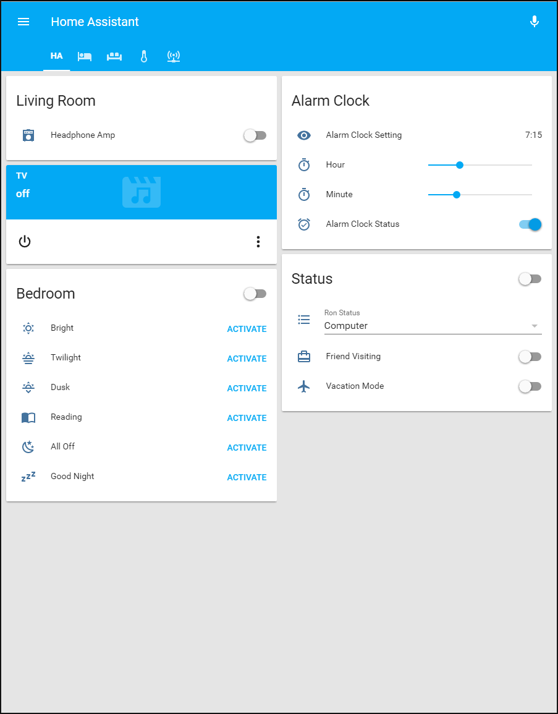
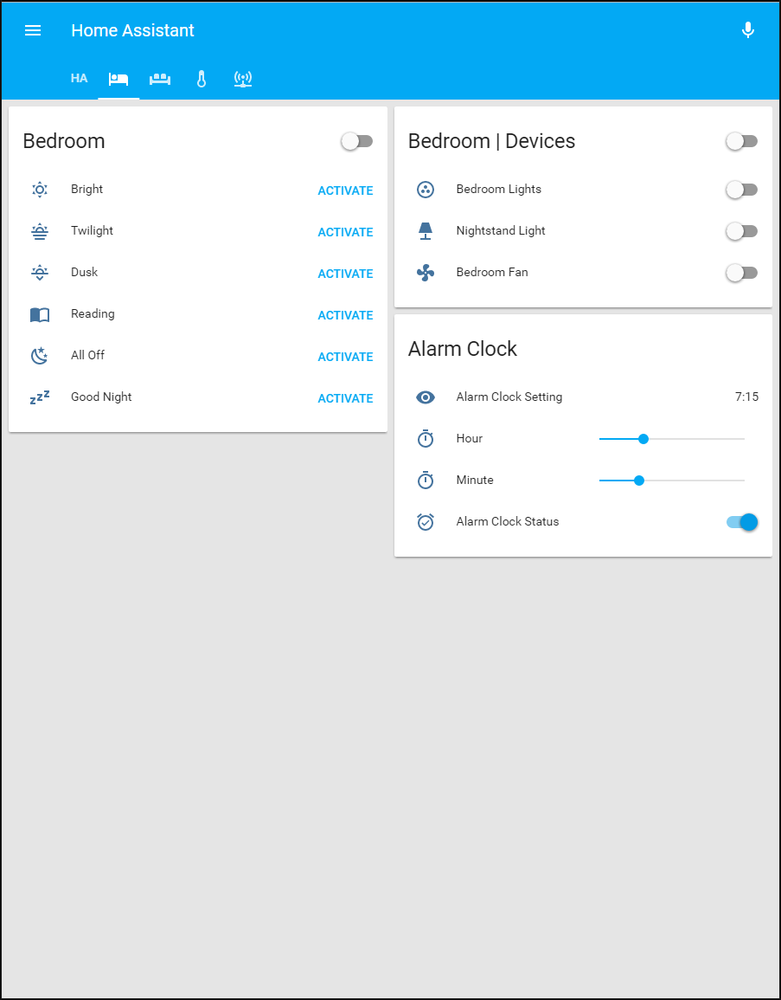
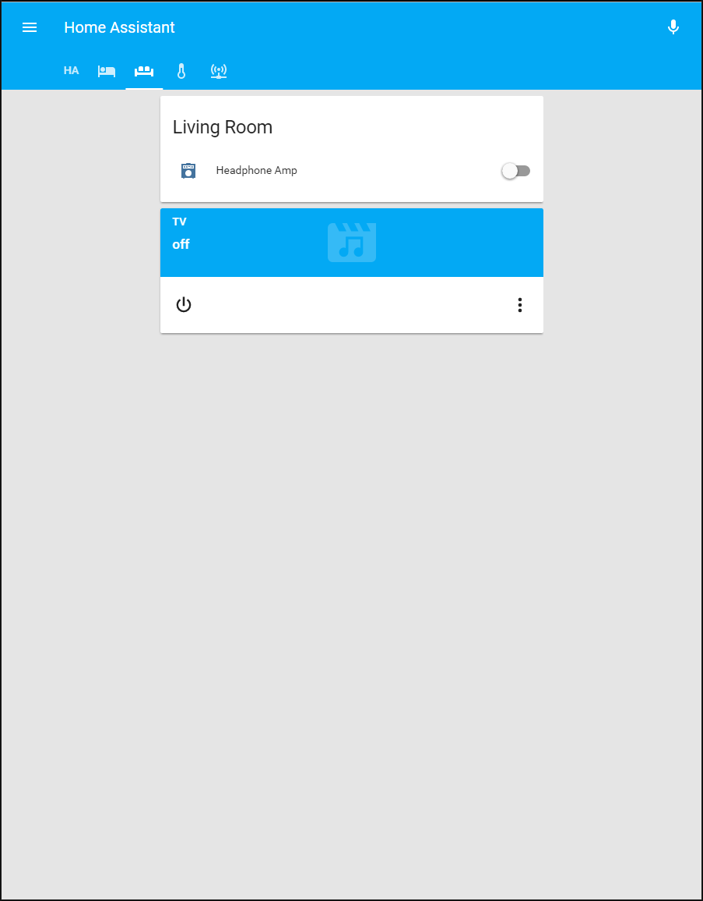
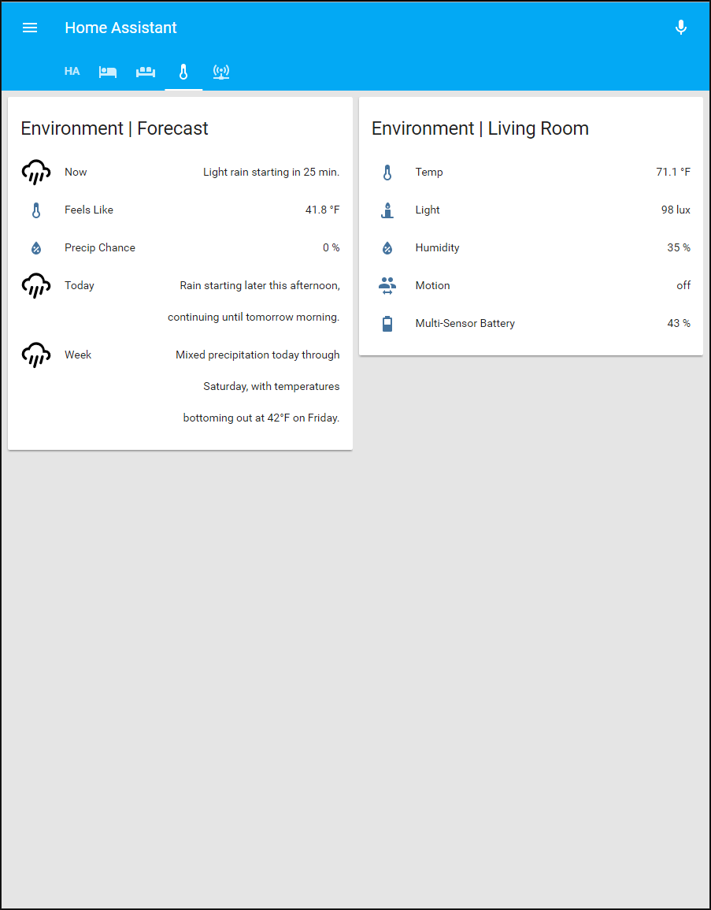
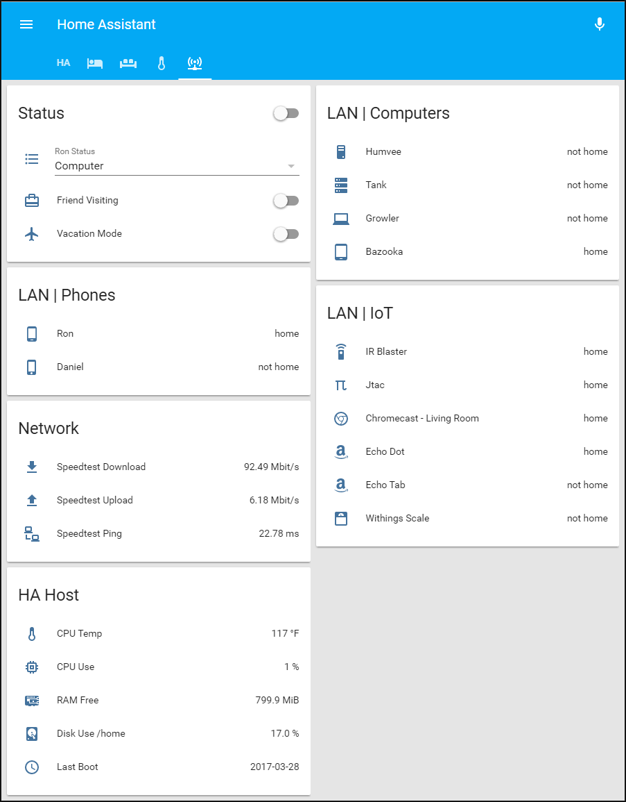

# Home Assistant Configuration
See below for my latest Home Assistant configuration. I tried to keep the UI simple and use automations for most of the device interaction. 

# Devices
* Z-Wave Controller - [MiCasaVerde Veralite](http://amzn.to/2nrPhQi)
  * Amperage sensor / switch - [Aeotec Smart Switch](http://amzn.to/2mNpZz0)
  * Motion, temperature, light, and humidity sensor - [Aeotec Multisensor](http://amzn.to/2nrQiry)
  * Lamp dimmer - [Leviton Lamp Module](http://amzn.to/2odMbPO)
* Lighting Controller - [Philips Hue](http://amzn.to/2nJc5wV)
  * Light Bulbs x2 - [Hue Bulbs](http://amzn.to/2nJ89N0)
* IR Blaster - [Global Cache WF2IR iTach](http://amzn.to/2nrSWxH)
* RF Transmitter - [Superheterodyne 433Mhz kit](http://amzn.to/2nJcQ9B)
  * RF Outlets x5 - [Elekcity Outlet](http://amzn.to/2nrS3ou)
* IP Camera - [Foscam](http://amzn.to/2nrXmEK)
* Voice control - [Echo Dot](http://amzn.to/2ng4nr5)
  * Portable voice control - [Echo Tap](http://amzn.to/2mNqrNI)
* Media Player - [Google Chromecast](https://store.google.com/config/chromecast_2015)
* Network Attached Storage - [FreeNAS](http://www.freenas.org/) (I built my NAS based on [this motherboard](http://amzn.to/2ng2hHW))
  * Media Server - [Plex](https://www.plex.tv/)

# Screenshots

